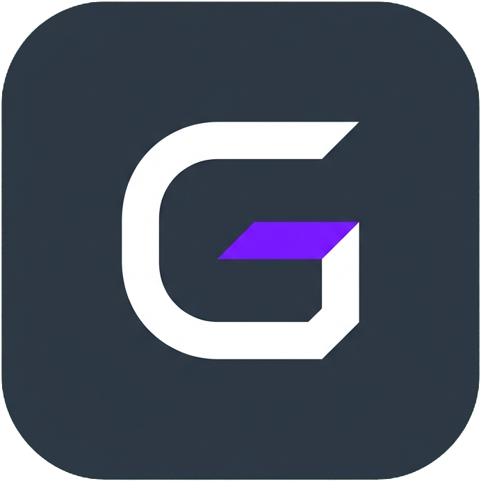
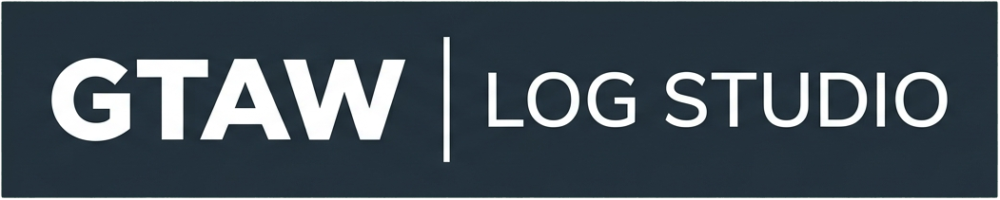
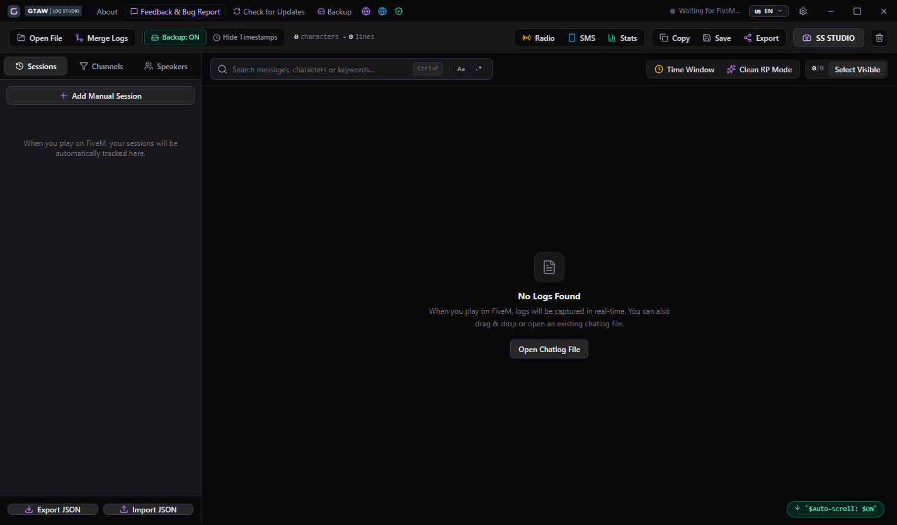
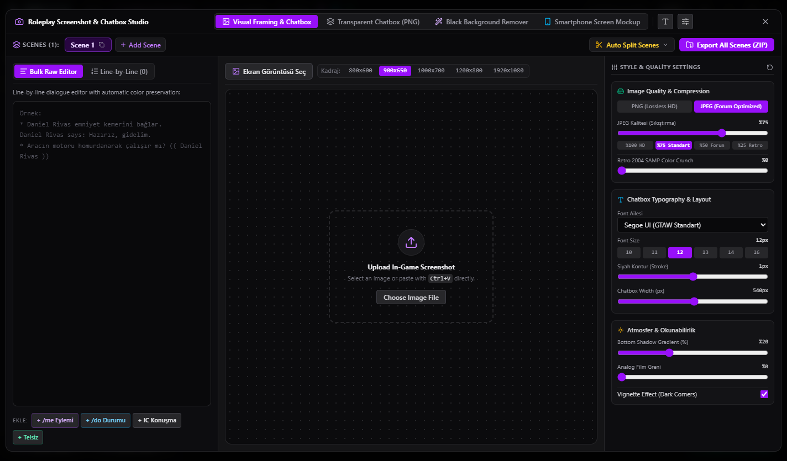

<p align="center">
  
</p>

<p align="center">
  
</p>

<p align="center">
  <strong>High-Performance FiveM Chatlog Engine, Auto-Backup System, Multi-POV Merger & Roleplay Screenshot Studio</strong>
</p>

<p align="center">
  
  
  
  
  
</p>

---

## Overview

**GTAW Log Studio** is an open-source suite designed for GTA World text-roleplay players, faction members, screenshot storytellers, and law enforcement agencies. It hooks directly into the FiveM client process to parse, colorize, and archive in-game dialogue in real time without causing any frame drops.

---

## Screenshots & Modules

### 1. Live Chatlog Viewer & Clean Roleplay Engine
Direct process hooking and live parsing of IC, /me, /do, PM, Radio, SMS, and Department channels.

<p align="center">
  
</p>

---

### 2. Roleplay Screenshot Studio (SS Maker)
Interactive canvas with customizable typography, stroke outlines, drop shadows, storyline scene splitting, and one-click transparent PNG clipboard export into image editing software like Photoshop.

<p align="center">
  
</p>

---

### 3. Smart Black Background Remover (Keyer)
Extracts clean, transparent dialogue text from solid black /blind in-game chatbox screenshots with zero color halo or anti-aliasing artifacts.

<p align="center">
  
</p>

---

### 4. Emergency & Radio Dispatch Console
Dedicated terminal parsing 10-Codes, unit callsigns, emergency alerts, and faction radio brackets for Law Enforcement and Medical Services.

<p align="center">
  
</p>

---

### 5. Multi-POV Log Merger
Chronologically interleaves chatlogs from multiple players present at a scene, automatically eliminating duplicate lines.

<p align="center">
  
</p>

---

## Key Features

- **Live Memory Engine**: Automatic FiveM process hook with zero polling overhead.
- **Storyline Scene Splitter**: Divides long logs into sequential scene cards based on customizable silence gaps (2m, 3m, 5m).
- **Multi-POV Log Merger**: Combines logs from multiple character perspectives into a unified chronological storyline.
- **Alt-Tab Aware Notifications**: Smart audio chimes sound only when mentioned or PMed while the game is unfocused.
- **Multi-Format Export**: Forum-ready BBCode ([color=...]), clean plain text, or backup JSON.
- **Internationalization (i18n)**: Fully translated into 5 languages (English, Turkish, Russian, French, Spanish).
- **In-App Issue Reporter**: Integrated bug reporting directly connected to GitHub Issues.

---

## Supported Languages

| Code | Language | Native Name |
| :---: | :---: | :---: |
| EN | English | English |
| TR | Turkish | Türkçe |
| RU | Russian | Русский |
| FR | French | Français |
| ES | Spanish | Español |

---

## Installation & Downloads

Executable builds are provided on the [GitHub Releases](https://github.com/create-tools/GTAW-Log-Studio/releases) page:

| Package | Filename | Description |
| :--- | :--- | :--- |
| **Windows Installer** | `GTAW Log Studio Setup 1.0.0.exe` | Standard Windows installer with shortcuts. |
| **Portable Standalone** | `GTAW Log Studio 1.0.0.exe` | Standalone binary requiring no installation. |

---

## Development & Build Instructions

### Prerequisites
- Node.js (v18 or higher)
- npm or yarn

### Setup
```bash
# Clone the repository
git clone https://github.com/create-tools/GTAW-Log-Studio.git
cd GTAW-Log-Studio

# Install dependencies
npm install

# Run development mode
npm start

# Build production binaries (Setup & Portable)
npm run dist
```

---

## License

This project is licensed under the **MIT License** - see the [LICENSE](LICENSE) file for details.

*Disclaimer: GTAW Log Studio is an independent community tool developed by Altay and is not affiliated with Rockstar Games, GTA World, or FiveM / Cfx.re.*
